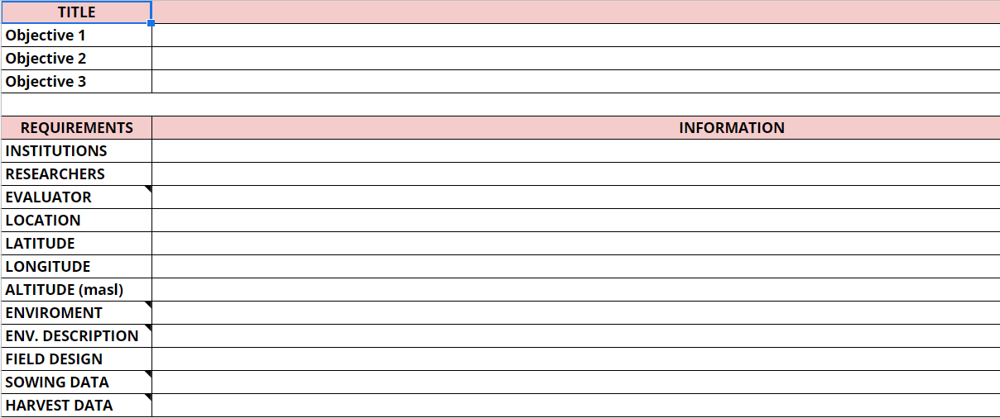
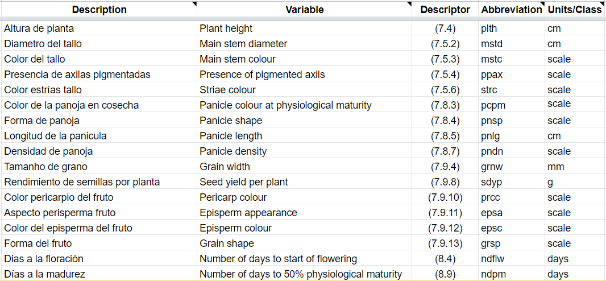
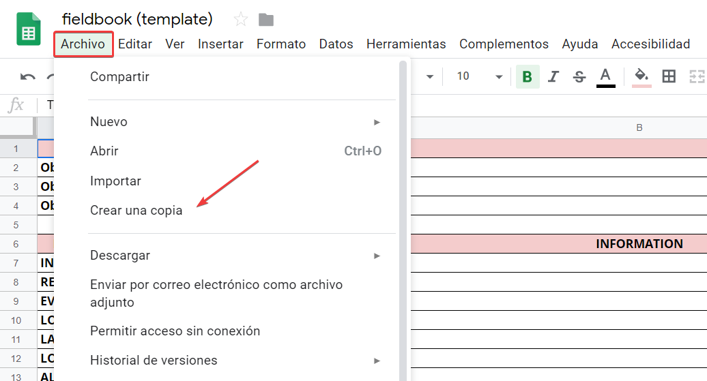

```{r dataset}
# source("cnfg/debug.r")
source("cnfg/setup.r")

sheets_auth(T)
url <- "https://docs.google.com/spreadsheets/d/1iIGsgXU_IBjmwqJ_Vo0sICUZpuTzZ_JGwD5ZgBG1jlk/edit#gid=0"
gs <- as_sheets_id(url)
# browseURL(url)

```


# Introducción

```{block, echo = T, type='rmd-warning'}

<!-- caution - important - note - tip - warning -->

Antes de iniciar a leer este manuscrito, si tienes alguna duda o sugerencia no dejes de escribir a mi correo: flavjack@gmail.com. Disculpen por los errores ortográficos, los cuales ire corrigiendo a medida que vaya avanzando el documento,  primero deseo que la ideas fluyan. Mencionar tambien que lo estoy escribiendo por la consola en R por lo que no es fácil de acceder al corrector ortográfico :), gracias por su comprension. Voy asustituir la "Ñ" por la "NH" por que los teclados alemanes no posee esa caracter xD.

```

Me interesé en escribir el presente manual por 2 razones, la primera para guiar a estudiantes o profesionales en como planear un proyecto de investigación de una manera facil y rápida, y la segunda por que mientras escribia mi proyecto de doctorado y organizaba la información de los experimentos de varios anho, me pasé dias ordenando bases de datos de otros estudiantes que ayudaron a colectar la información durante todo ese tiempo (2011-2019) y mas que organizar parece que estará tratano de descifrar jeroglificos, ya que parece que solo él que lo escribio sabe que significa, lo que consume mucho tiempo y es cansativo, por lo que decidí darme una pausa y escribir este manual.

Con frecuencia estudiantes me escriben ya que tienen dudas para iniciar su proyecto de investigación o dar forma a un idea, algunos me hacen muchas preguntas y afirmaciones, tales como: Cómo planteo mi proyecto de investigación?, Qué tipo de análisis debo usar?, mi asesor no tiene tiempo para ayudarme, no se como iniciar mi trabajo, estoy perdido ingeniero, etc...  y la verdad me gustaria apoyarlos de forma personalizada a cada uno de ellos y muchas veces no cuento con el tiempo suficiente para hacerlo, entonces emprendí la idea de hacer este manual que puede servir de guía a los que por primera vez esten desarrollando un proyecto de investigación o algunas recomendaciones para los que ya tiene experiencia.

Ser investigador es un trabajo basado en la disciplina, perseverancia y la mejora continua que se va ganando con el tiempo y la experiencia y muchas veces se logra a base de prueba y error y horrores tambien xD, así que no te sientas aturdido o decepcionados si recien estas comenzando... recuerda que para que un arbol sea grande y fuerte en algun momento fue un pequenho retonho que tuvo que luchar contra muchas condiciones adversas... Trataré en este documento ser lo mas breve y conciso para no ser cansativo con los que deseen leer el manual.

A traves de este documento tengo planeado mostrarles (ire escribiendo poco a poco): i) Como plantear una idea de investigación, ii) Como hacer un libro de campo para coletar la información, iii) El uso de herramientas libres para la redacción, iv) Como redactar un documento o un articulo técnico científico. Tambien ire inclueyendo videos y links de material para ayudar al desarrollo de los trabajos de una manera más eficiente y rápida. El manuscrito lo disponibilizaré en formato epub para los que deseen leerlo en sus celulares o tablets.

Este manul esta basado en el documento que mi asesor del doctorado compartió en algun comento conmigo [@kamoun2013GOHREP] el cual me parecio muy interesante y en base a eso hice algunas modificaciones y lo traducí al espanhol para los estudiantes que trabajan conmigo en Perú. Recuerda que este documento es una recomendación en el planeamiento inicial de un trabajo de investigación y puede servir como base para el desarrollo de una idea experimental. Por lo que esta guía puede ayudar a nuevos investigadores a como generar su proyecto de investigación y organiyar su información de manera adecuada donde cualquier otra persona envuelta en el trabajo pueda entender y analizar siempre con la concepcion de un trabajo de investigación muchas veces se trata de un trabajo en equipo.

Espero que este pequenho manual sea de gran utilidad para los que lo lean y el autor esta dispuesto a recibir todo tipo de criticas (destructivas y constructivas), ya que la crítica es la base de la mejora continua :). 

# Estructura del plan experimental

Inicialmente para la formulación de la idea del trabajo no es necesario incluir referencias y puede ser escrita con tus propias palabras. A medida que la idea se va tornando más estructurada se puede ir incluyendo referencias para sustentarlas. Para estructurar la idea de un plan experimental o trabajo de investigación se sugiere que debe contener como mínimo la siguiente estrúctura. 

## Meta

El objetivo principal del trabajo, debe ser escrita como un título provisional de la investigación. Conteniendo la mayor cantidad de informacion posible en la oración

## Hipótesis

Es la pregunta de investigación escrita en un parrafo, la cual debe ser redactada como una pregunta o como una afirmación a la idea que se desea proponer.

## Fundamento

Escribir los fundamento o razones lógicas para sustentar la idea. Posteriormente se puede adicionar afirmaciones o descubirmientos contenidos en documentos o artículos cientificos a los fundamentos en forma de cita bibliográfica.

## Objetivos 

Las acciones o pasos para llegar al cumplimiento de la meta. Deber ser escrita en forma de acción. (ie. Se evaluará..., Se estimará..., Se realizaran..., etc)

## Plan experimental

Inicialmente puede ser un bosquejo de como se llevará acabo el trabajo de investigación. Esto será la base para el desarrollo de los Materiales y Métodos que encontramos en los trabajo de investigación.

## Proyecto de investigación {-}

Luego del desarrollo de los puntos mencionados en la estructura del plan experimental, se tendra una idea de como se construirá el flujo de tranajo lo que puede posteriormente plasmarse en un proyecto de investigación para un trabajo de tesis o artículo.

# Diseño experimental

```{block, echo = T, type='rmd-important'}

<!-- caution - important - note - tip - warning -->

En esta sección se utilizará algunas terminologías en ingles, asi que si tienes algunas dudas puedes usar el traductor, recuerda que si deseas ser un investigador por lo menos debes manejar algunos terminos básicos en ingles y mejor si puedes aprenderlo, esto te ayudará a tener a la mano mucha información reciente.

```

El planeamineto de un experimento es parte crusial para definir el éxito de un trabajo experimental, mismo asi que se realice un plan de trabajo acontencen diferentes imprevistos. Para ayudar a la reducción del caos introduciremos el termino **fieldbook** que significa **“libro de campo”** y sera desarrollada en una hoja de calculo virtual, el cual contiene pestanhas con los datos mínimos que son necesarios para tu trabajo de investigación, de esta manera ahorrar tiempo en el procesamiento y análisis de los datos, ya que muchas veces no son los análisis los que consume el tiempo del investigador, si no la reorganizacion de los datos colectados.

```{block, echo = T, type='rmd-note' }

<!-- caution - important - note - tip - warning -->

Muchas veces organizamos los información de manera que es más facil para nuestra comprension "humana", lo que al final genera problemas ya que debemos reorganizar toda la información ya que la coputadoras presentan una estructura especial para analizar los datos.

```

## Libro de campo "Fieldbook"

```{block, echo = T, type='rmd-important' }

<!-- caution - important - note - tip - warning -->

Para esta sección haremos uso de hojas cálculo, y por experiencia propia les recomiendo dejar de usar excel para colectar los datos de experimentos, en este caso es mejor hacer uso de las hojas de cálculo virtuales, especificamente las de google spread sheets. Por que presentan algunas ventajas que enumeraré a continuación:

1. Permite manejar y visualizar el historial de cambio durante la colecta de datos.
1. Permite guardar diferentes versiones del documento en una misma línea de tiempo.
1. Se puede trabar en forma grupal sin generar conflictos entre los usarios.
1. Se puede colectar la información directamente haciendo uso de los celulares.
1. Se puede importar directamente a R con el paquete googlesheet4 [@R-googlesheets4].
1. Permite descargar en disversos formatos (pdf, xslx, csv, etc).

Google sheets: <https://docs.google.com/spreadsheets/u/0/>

```

## Nombre del libro de campo

En primer lugar iniciaremos con definir el nombre del libro de campo, ya que muchas veces aunque paresca sencillo colocar un nombres a un documento es un gran reto, y luego de transcurrido algun tiempo se nos dificulta encotrarlo. Para nombrar los libros de campos se sugiere usar la siguiente nomenclatura.

### Fecha

En el formato internacional (YYYYMMDD), usualmente la fecha esta relacionada al inicio o establecimiento del experimento lo que nos ayudara a contar los dias despues del inicio de trabajo y una forma facil de filtrar si tenemos varios trabajos durante el mismo anho.

### Abreviacion de lugar

Permite facilitar la identificacion del lugar donde se realizó el experimento o trabajo de investigación.

### Breve descripción

Palabras claves o ayuda memoria para recordar el nombre del trabajo, puede ir entre paretesis y no muy extenso.

### Ejemplo {-}

El nombre del libro de campo debe ser sustituir el nombre actual de la plantilla donde esta escrito como "fieldbook (template)".

```{block, echo = T, type='rmd-note' }

<!-- caution - important - note - tip - warning -->

**Nombre de libro de campo:** 

20170819CMC (germinacion quinua)

**Interpretacion:**

Experimento de germinación en quinua realizado en Camacani el 19 de agosto de 2017.

```

```{block, echo = T, type='rmd-tip'}

<!-- caution - important - note - tip - warning -->

Es muy común que al revisar la base de datos de algunos investigadores y estudiantes me encuentro usualemente con que este problema, terminan con varios archivos con diferentes copias de los datos y varios archivos con pasos intermedios. 
  
- datos
- datos_originales
- datos_V01
- datos_V02
- data_V01
- data_DDMMYY
- final_data
- ultima_data
- datos_sin_outliers
- y muchos otros...

Si estás trabajando con datos, debió haber en algun momento en el que tenías un archivo con un nombre único, pero ahora probablemente tiene varias copias. Es una práctica que debemos evitar y solo deberiamos tener una base de datos organizada con multiples pestanhas.

```

## Pestanhas en el libro de campo

```{block, echo = T, type='rmd-warning'}

<!-- caution - important - note - tip - warning -->

No es recomendable crear diversas hoja de calculo para un experimento, es mejor adicionar pestanhas al libro de campo, de esta forma toda tu información estará en un solo documento, y será facil de manejar y compartir entre tus colaboradores.

```

Para el libro de campo (fieldbook) se sugiere que por lo menos esté constituido por 7 pestanhas ensenciales, las cuales pueden ser incrementadas de acuerdo a las necesidades de cada experimento (i.e. informacion metereologica, planilla de riego, análisis de suelo, etc).

A continuación se realizará una descripción de lo que debe contener cada pestanha

### Informacion (info)

Esta pestanha es clave y debe ser completada en su totalidad. Al inicio del plan experimental y revisarla a la conclusión. Esta información es valiosa al momento de redactar algun reporte o escribir un artículo ya que permite tener toda la información a la mano, asi como tambien es muy importante ya que contiene los objetivos del trabajo lo que permitirá a otros colaboradores entender el trabajo.

```{r fbinfo, fig.cap= "Datos mínimos y obligatorios en el hoja de información (info) del libro de campo (fieldbook)"}

```

### Variables (var)

Esta pestanha es clave para entener el libro de campo y las abreviaciones que usemos, asi como estandarizar las variables y hacerlas fácil de colectar. Se realizará una lista de las variables a evaluar durante el experimento, tambien se adicionara las abreviaturas de las variables las cuales iran como encabezados en la hoja del libro de campo (fb).

```{r fbvar, fig.cap="Ejemplo de como debe estructurarse la pestaña de las variables (var)"}

```
  
```{block2, echo = T, type='rmd-note' }

Todo trabajo que este relacionado con descripción de plantas siempre se debe tener en cuenta el uso de descriptores como patron para determinar los nombres y mucho mejor si se puede trabajar con los nombres en ingles. 

**Ejemplo** 
  
Lista de variables para el cultivo de quinua [@bioversityinternational2013Descriptores]

En la figura \@ref(fig:fbvar) en la columna *Description* esta el nombre de la variable en espanhol (tal como se me ocurrio sin consultar el descriptor), basado en ese nombre se busco el nombre en ingles de la variable y en la columna *Variable* esta el nombre de acuerdo al descriptor y junto a esa columna *Descriptor* que corresponde al número de la variable dentro del descriptor del cultivo (para facilitar su busqueda posterior y otros puedan encontrarlo sin ningun problema). En base a la columna *Descriptor* se le asignó una abreviación ( columna "*Abbreviation*"), la cual será utilizada en el libro de campo (fb) para recolectar la información. Toda variable dentro del libro de campo se le debe asignar las unidades de medición o el tipo devarible que se esta colectando, esta columna esta como *Unit/Class*.

Esta es la estructura básica sugerida para hacer la pestanha de variables en un libro de campo y es importante para que los otros mimbros del equipo puedan entender como fue tomada la información.

```
  
### Libro de campo (fb)

Pestanha que contendra el disenho o la base de datos de la información a colectar. Se puede introducir el tipo de diseño experimental (ie. DCA, DBCA, DCL) los cual puede ser generado con el paquete agricolae [@R-agricolae] en el software estadistico R [@R-base].

### Disenho de campo (fds)

Será utilizado en caso de algun distribución espacil de un disenho estadistico (ie. DCA, DBCA, DCL) lo que permitira guiarse durante las actividades como tambien para imprimir el croquist del trabajo. 

```{block, echo = T, type='rmd-tip' }

<!-- caution - important - note - tip - warning -->

Se recomienda modificar el diseño de campo en la misma hoja virtual y no introducir el disenho como una imagen. Ya que dificultará la exportación de disenho para su uso como croquis.

```

### Cronograma (crn)

Pestanha dedicada al planeamiento de la cronología de las evaluaciones y actividades y así poder organizar las acciones durante el experimento (ie. uso de materiales, prestamos de equipos, disponibilidad de espacios, etc).

### Diario (dry)

Es la bitácora del investigador, donde se informacion de lo que va aconteciendo durante el desarrollo del experimento (lo bueno, lo malo y lo feo). Se sugiere registrar el día y el conteo en dias despues del inicio del experimento.

### Presupuesto (bdg)

Muchos investigadores omiten esta parte durante la planificación de sus proyectos, si bien el experimentos puede llevarse acabo dentro de una institución de investigación que cubra todo los gasto y materiales, es recomendable tener una estimación de los costos ya que en el futuro podras planear tus trabajos con costos realistas y no quedarse sin fondos durante la ejecución del proyecto (problema usual con muchos investigadores).

## Plantilla de libro de campo (Fieldbook)

Para poder acceder a la plantilla del libro de campo deben hacer una copia del documento para ustedes mismos. Con esto tendran acceso al documento y podran modificar de acuerdo a sus necesidades.

```{r}
shiny::HTML(
'
<iframe src="https://docs.google.com/spreadsheets/d/1Y6Wrwz5LyFh0nge8DyOhfLGmRu0N7rQKN9Vv7UoBQ60/edit#gid=661894213" style="width: 100%; height: 450px" scrolling="no" marginwidth="0" marginheight="0" frameborder="0" vspace="0" hspace="0"></iframe>
'  
)
```

### Cómo crear una copia de la plantilla?

1. Ir a link: <https://docs.google.com/spreadsheets/d/1Y6Wrwz5LyFh0nge8DyOhfLGmRu0N7rQKN9Vv7UoBQ60/edit#gid=661894213>
1. Ir a *archivos*
1. *Crear una copia*
1. Renombrar el archivo

```{r figtmpl, fig.cap="Proceso de como crear una copia propia de la plantilla del libro de campo (fieldbook)"}



```

# Colecta de datos

### Etiquetas de unidades experimentales

El etiquetado de los datos es una actividad que siempre se deja de lado, y muchas veces por el trabajo que genera. Pues piensalo 2 veces antes de dejar esta actividad para el final, un etiquetado adecuado, facilitara la evaluación y toma de datos en todas las instancias del proyecto.

### Evaluacion de las variables

Independientemente del tipo de diseño que hayas elegido, este será utilizado para analizar los datos, la informacion sera tomada e inserida al libro de campo para cada unidad experimental.
